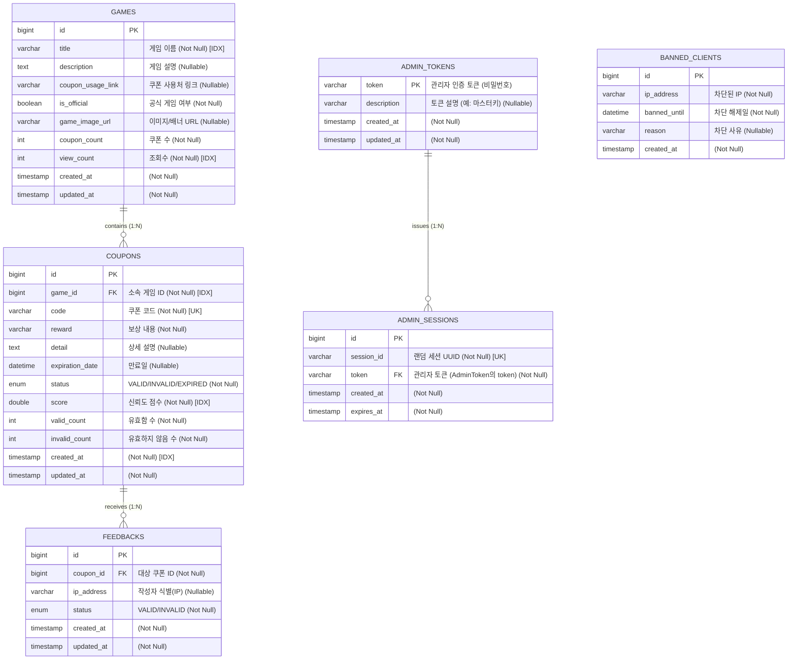

# everyones-coupon

## 개발 환경

- **JDK**: 17
- **Spring Boot**: 3.5.7
- **Gradle**: 8.14.3 (Groovy DSL)

## 데이터베이스 ERD
> **참고**: Mermaid 문법이 `NOT NULL`, `INDEX` 등의 제약조건을 완벽하게 지원하지 않아, 컬럼 설명란에 다음과 같이 명시했습니다.
> - `(Not Null)` / `(Nullable)`: Null 허용 여부
> - `[IDX]`: 일반 인덱스 (Index)
> - `[UK]`: 유니크 인덱스 (Unique Key)



## 관리자 토큰(Magic Token) 설정

- 이 애플리케이션은 관리자 전용 토큰(일명 매직 토큰, 비밀번호 역할)을 지원합니다.
- 배포 시 리터럴 토큰을 DB에 저장하려면 `application.properties` 또는 환경변수로 `app.admin.init-token`을 설정하세요.
    - 예: `app.admin.init-token=literal-token-123` 또는 env `APP_ADMIN_INIT_TOKEN=literal-token-123`
- 자동 생성 옵션: `app.admin.auto-generate=true`를 설정하면 애플리케이션 시작 시 난수 토큰이 자동 생성되어 DB에 저장됩니다.
    - 권장(안전): 자동 생성 후 토큰은 안전하게 저장(Secret Manager 또는 K8s Secret)하시고, 콘솔에 출력하지 마세요.
- 기본 설명: `app.admin.init-description` 프로퍼티로 토큰 설명을 추가할 수 있습니다.

예: Kubernetes 환경에서 Secret으로 지정하여 배포할 경우
```yaml
apiVersion: v1
kind: Secret
metadata:
    name: admin-token-secret
type: Opaque
data:
    # base64 인코딩된 토큰
    APP_ADMIN_INIT_TOKEN: "bGl0ZXJhbC10b2tlbi0xMjM="

---
apiVersion: apps/v1
kind: Deployment
spec:
    template:
        spec:
            containers:
            - name: everyones-coupon
                image: your-image
                env:
                - name: APP_ADMIN_INIT_TOKEN
                    valueFrom:
                        secretKeyRef:
                            name: admin-token-secret
                            key: APP_ADMIN_INIT_TOKEN
```

보안 권고: 토큰 값은 민감 정보이므로 로그(콘솔)에 노출하면 안 되며, 배포 시에는 Secret Manager(K8s Secret, Vault 등)를 사용해 안전하게 관리하세요.

## Swagger / OpenAPI (간단)

- 애플리케이션 실행 후 접근 가능한 경로 (기본값):
    - Swagger UI (브라우저 UI): `http://<HOST>:<PORT>/swagger-ui/index.html` 또는 `http://<HOST>:<PORT>/swagger-ui.html`
    - OpenAPI JSON: `http://<HOST>:<PORT>/v3/api-docs`
    - (참고) API docs의 기본 경로는 Springdoc 설정에 따라 다를 수 있습니다.

- 인증 관련 안내: 관리자용 API는 인증(Authorization header 또는 세션 쿠키)을 요구하므로, 스웨거에서 엔드포인트를 테스트할 때는 Authorization 헤더(Bearer 토큰)를 직접 설정하거나, 로그인을 통해 `ADMIN_SESSION` 쿠키를 발급 받아 사용하세요.


## 이미지 저장(Image Store) 동작 안내

- 현재 기본 `ImageStore` 구현은 `FakeImageStore`로 설정되어 있으며, 이미지 바이트를 실제로 저장하지 않고 가짜 URL을 반환합니다.
    - 반환되는 URL 형식은 기본적으로 `/uploads/{uuid}-{filename}` 처럼 보이며, 개발/테스트에서 편의성을 제공하기 위한 것입니다.
    - 이 동작은 `ImageStoreConfig`에서 기본 빈으로 등록되어 있기 때문에, 프로덕션에서는 대체 구현(예: `AzureBlobImageStore`, `S3ImageStore`, `LocalImageStore`)을 빈으로 등록해 사용하시길 권장합니다.

- 운영(프로덕션) 환경으로 전환 시 권장 사항:
    - **프로덕션**에서는 실제로 이미지를 저장하는 구현체(Azure Blob, S3, 또는 파일 스토리지)를 등록하세요.
    - 예시: `AzureBlobImageStore`를 추가하고 `@Profile("prod")`로 등록하거나, `ImageStoreConfig`에서 프로퍼티나 프로파일을 통해 교체하도록 구성하세요.

- 프론트엔드 처리 권장사항:
    - Game 엔티티의 `gameImageUrl`이 `null`이거나 빈 문자열인 경우, 프론트엔드에서는 정적 기본 이미지를 표시하도록 처리하세요(예: `/static/default-game-image.png`).
    - FakeImageStore는 개발/테스트용이며 실제 이미지를 제공하지 않기 때문에, 배포 시 기본 이미지 노출 로직을 반드시 확인하세요.

예시(프로덕션에서 Azure Blob 사용):
1. `AzureBlobImageStore` 구현체 추가
2. `@Profile("prod")`로 빈 등록하거나 `ImageStoreConfig`에서 `@ConditionalOnProperty`로 설정
3. 프로덕션 환경에서 S3/Azure 자격증명과 Container 정보를 설정


