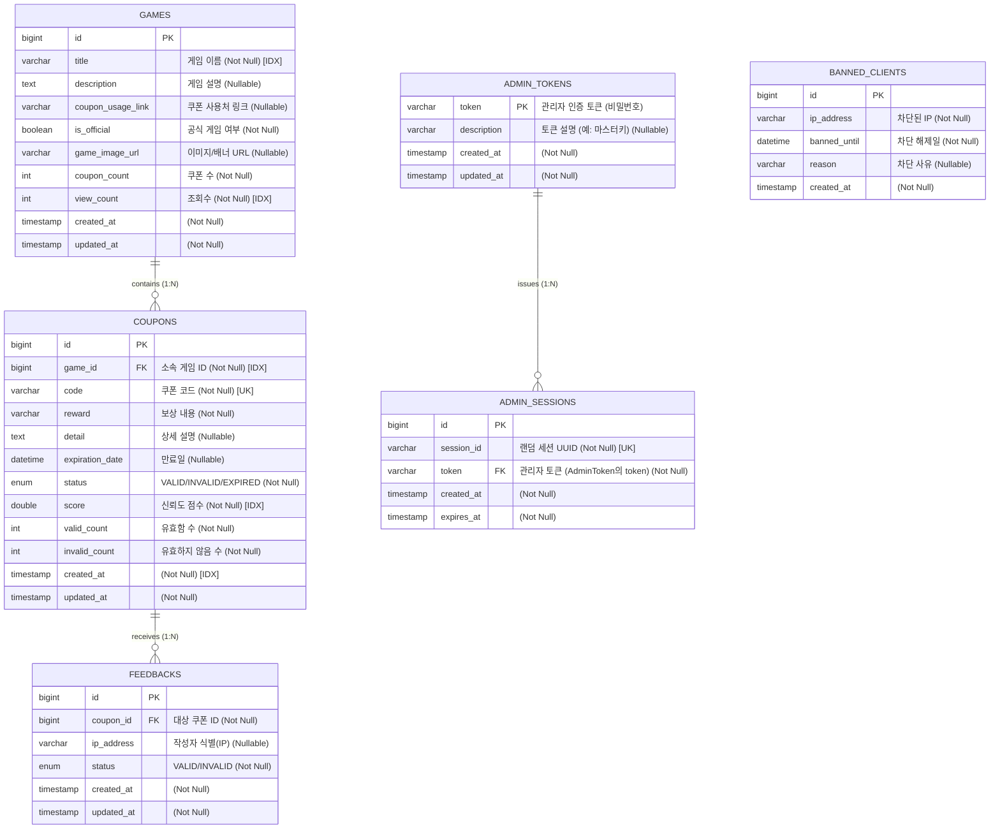

# everyones-coupon

## 개발 환경

- **JDK**: 17
- **Spring Boot**: 3.5.7
- **Gradle**: 8.14.3 (Groovy DSL)

## 데이터베이스 ERD
> **참고**: Mermaid 문법이 `NOT NULL`, `INDEX` 등의 제약조건을 완벽하게 지원하지 않아, 컬럼 설명란에 다음과 같이 명시했습니다.
> - `(Not Null)` / `(Nullable)`: Null 허용 여부
> - `[IDX]`: 일반 인덱스 (Index)
> - `[UK]`: 유니크 인덱스 (Unique Key)

