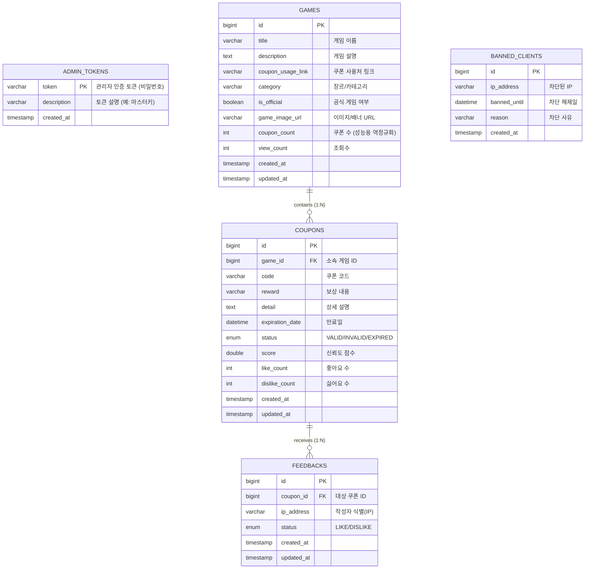

# everyones-coupon

## 개발 환경

- **JDK**: 17
- **Spring Boot**: 3.5.7
- **Gradle**: 8.14.3 (Groovy DSL)

## 데이터베이스 ERD

```mermaid
erDiagram
    %% 1. 관리자 토큰 테이블 (단일 인증 수단) - Source: 91, 476
    ADMIN_TOKENS {
        varchar token PK "관리자 인증 토큰 (비밀번호)"
        varchar description "토큰 설명 (예: 마스터키)"
        timestamp created_at
    }

    %% 2. 게임 테이블 (Class: Game) - Source: 85
    GAMES {
        bigint id PK
        varchar title "게임 이름"
        text description "게임 설명"
        varchar coupon_usage_link "쿠폰 사용처 링크"
        varchar category "장르/카테고리"
        boolean is_official "공식 게임 여부"
        varchar game_image_url "이미지/배너 URL"
        int coupon_count "쿠폰 수 (성능용 역정규화)"
        int view_count "조회수"
        timestamp created_at
        timestamp updated_at
    }

    %% 3. 쿠폰 테이블 (Class: Coupon) - Source: 79
    COUPONS {
        bigint id PK
        bigint game_id FK "소속 게임 ID"
        varchar code "쿠폰 코드"
        varchar reward "보상 내용"
        text detail "상세 설명"
        datetime expiration_date "만료일"
        enum status "VALID/INVALID/EXPIRED"
        double score "신뢰도 점수"
        int like_count "좋아요 수"
        int dislike_count "싫어요 수"
        timestamp created_at
        timestamp updated_at
    }

    %% 4. 피드백 테이블 (Class: Feedback) - Source: 88
    FEEDBACKS {
        bigint id PK
        bigint coupon_id FK "대상 쿠폰 ID"
        varchar ip_address "작성자 식별(IP)"
        enum status "LIKE/DISLIKE"
        timestamp created_at
        timestamp updated_at
    }

    %% 5. 차단 클라이언트 테이블 (Class: AbuseChecker) - Source: 93
    BANNED_CLIENTS {
        bigint id PK
        varchar ip_address "차단된 IP"
        datetime banned_until "차단 해제일"
        varchar reason "차단 사유"
        timestamp created_at
    }

    %% 관계 정의
    GAMES ||--o{ COUPONS : "contains (1:N)"
    COUPONS ||--o{ FEEDBACKS : "receives (1:N)"
```
